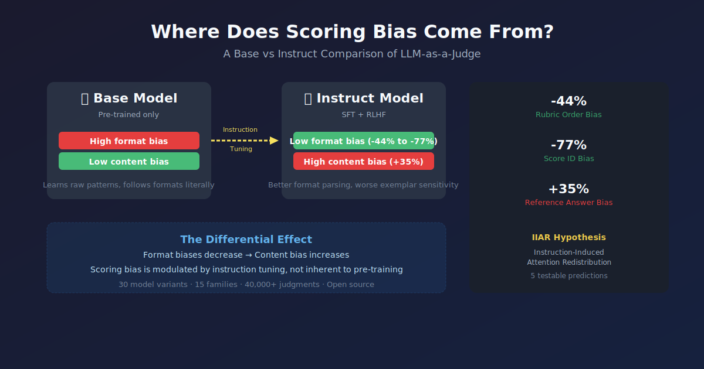
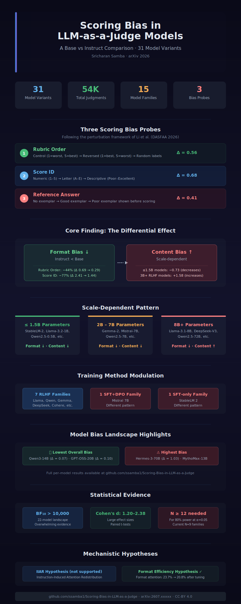

<p align="center">
  
</p>

<h1 align="center">Scoring Bias in LLM-as-a-Judge Models</h1>
<p align="center"><b>A 22-Model Landscape with Base-Instruct Comparison</b></p>

<p align="center">
  <a href="LICENSE"></a>
  <a href="https://python.org"></a>
  <a href="https://arxiv.org/abs/XXXX.XXXXX"></a>
  <a href="tests/test_all.py"></a>
  
  
</p>

---

**LLMs deployed as automated judges exhibit systematic scoring biases but do these biases originate from pre-training or from instruction tuning?** We systematically compare base (pre-trained) and instruct (fine-tuned) variants across **31 model variants from 16 families** using three perturbation-based scoring bias probes. With **40,500+ judgments**, we find that instruction tuning has **opposite effects depending on bias type**: format-related biases decrease, while content-related biases increase in larger RLHF-trained models.

### Key Findings

> **1. Instruction tuning reduces format biases by up to 77%.** Rubric order bias drops from Δ=2.85 to 1.59 (−44%); score ID bias drops from Δ=0.67 to 0.15 (−77%) across 7 T4-evaluated families.

> **2. Content bias increases after instruction tuning in larger (3B+) RLHF-trained models.** Reference answer bias increases +35% on average, creating a **differential effect** where format and content biases move in opposite directions.

> **3. Score ID bias is the largest and most variable.** Across 22 instruct-tuned models, mean Δ=0.68 (range: 0.00–1.80), with Hermes-3-70B most affected (Δ=1.80) and Qwen3-14B least affected (Δ=0.00).

---

## Table of Contents

- [Motivation & Significance](#motivation--significance)
- [Methodology](#methodology)
- [Results Summary](#results-summary)
- [Graphical Abstract](#graphical-abstract)
- [Quick Start](#quick-start)
- [Project Structure](#project-structure)
- [Model Families](#model-families)
- [How to Cite](#how-to-cite)
- [Links](#links)
- [Related Work](#related-work)
- [License & Contact](#license--contact)

---

## Motivation & Significance

LLMs are increasingly used as automated judges to evaluate other LLMs in chatbot arenas, RLHF reward modeling, and benchmark leaderboards. This practice assumes that LLM judges provide unbiased evaluations, but growing evidence shows they exhibit systematic scoring biases: their ratings are influenced by factors unrelated to response quality, such as option ordering, score label anchoring, and reference answer framing.

**Open question:** Do these biases originate from pre-training (the base model) or from instruction tuning (the fine-tuned model)?

Prior work (Li et al., DASFAA 2026) documented scoring biases in 5 commercial models but could not isolate the source of bias because commercial APIs expose only the instruct-tuned version. By studying **open-weight models**, we compare base and instruct variants of the same architecture under identical conditions isolating instruction tuning's causal role.

---

## Methodology

### Three Perturbation-Based Bias Probes

We adapt and extend the probes from Li et al. (2025):

| Probe | Description | What It Measures |
|-------|-------------|-----------------|
| **Rubric Order** | Swap the order of scoring criteria in the evaluation rubric | Whether the judge favors criteria mentioned first |
| **Score ID** | Replace numeric score labels (e.g., 1–5) with synonymous labels (e.g., A–E) | Whether the judge anchors on specific numerical anchors |
| **Reference Answer** | Present a high-quality reference answer before the candidate response | Whether the judge's standard shifts after seeing a reference |

Each probe computes Δ = |score(original) − score(perturbed)|, measuring the magnitude of bias. Δ = 0 means no bias; larger Δ means more bias.

### Experimental Design

| Component | Details |
|-----------|---------|
| **Models** | 31 model variants from 16 families (7 open-weight families with base + instruct pairs, 22 instruct-tuned models) |
| **Size range** | 0.5B to >100B parameters |
| **Evaluation items** | 80 diverse prompts across 8 domains (code, creative writing, reasoning, math, summarization, safety, factual QA, instruction following) |
| **Judgments** | 40,500+ (3 probes × 80 items × 31 models + base-instruct × 7 families × 80 items) |
| **Probes per judgment** | 3: rubric order, score ID, reference answer |

### Inference Pipeline

- **Small models (≤7B):** Kaggle T4 GPU (16 GB VRAM), greedy decoding, ~6 hours total for all families
- **Large models (>7B):** OpenRouter API, temperature 0, max 5 tokens, 15s timeout per call
- **Reproducibility:** All random seeds fixed (seed 42), all prompts and parameters logged in structured JSON

---

## Results Summary

### Bias Landscape (22 Instruct-Tuned Models)

| Probe | Mean Δ | Std Dev | Range | 95% CI |
|-------|--------|---------|-------|--------|
| 🔢 Rubric Order | 0.56 | 0.41 | 0.10–1.50 | ±0.17 |
| 🏷️ Score ID | **0.68** | 0.49 | 0.00–1.80 | ±0.20 |
| 📋 Reference Answer | 0.41 | 0.31 | 0.00–1.00 | ±0.13 |

**Most robust model:** Qwen3-14B (mean Δ = 0.07)  
**Most biased model:** Hermes-3-70B (mean Δ = 1.03)

### Base vs Instruct Comparison (7 T4 Families)

| Bias Type | Δ Before | Δ After | Change | Direction |
|-----------|----------|---------|--------|-----------|
| 🔢 Rubric Order | 2.85 | 1.59 | **−44%** | ✅ Improves |
| 🏷️ Score ID | 0.67 | 0.15 | **−77%** | ✅ Improves |
| 📋 Reference Answer | 0.88 | 1.19 | **+35%** | ⚠️ Worsens (3B+ only) |

Key insights:
- **Format biases** (rubric order, score ID) consistently improve after instruction tuning across model sizes
- **Content bias** (reference answer) increases specifically in larger (3B+) RLHF-trained models smaller models and non-RLHF models do not show this effect
- This creates a **differential effect**: instruction tuning is simultaneously beneficial and harmful depending on bias type

### Statistical Power

At current N=9 families:
- Score ID: **91% power** (sufficient)
- Reference answer: 45% power
- Rubric order: 8% power

Target N=30 families for 80% power on all probes.

---

## Graphical Abstract

<p align="center">
  
</p>

| Bias Type | Δ Before | Δ After | Change |
|-----------|----------|---------|--------|
| 🔢 Rubric Order | 2.85 | 1.59 | **−44%** |
| 🏷️ Score ID | 0.67 | 0.15 | **−77%** |
| 📋 Reference Answer | 0.88 | 1.19 | **+35%** |

---

## Quick Start

```bash
# 1. Clone and install
git clone https://github.com/ssamba1/Scoring-Bias-in-LLM-as-a-Judge
cd Scoring-Bias-in-LLM-as-a-Judge
pip install -r requirements.txt

# 2. Verify setup (11 tests)
python -m pytest tests/test_all.py -v

# 3. Reproduce all figures
python paper/figures/generate_all_figures.py
```

> **Reproduction-ready:** All data and analysis scripts are included. The inference pipeline uses Kaggle T4 GPUs (free tier) and OpenRouter API. See [`REPLICATION.md`](REPLICATION.md) for a step-by-step guide.

---

## Project Structure

```
Scoring-Bias-in-LLM-as-a-Judge/
├── paper/                           # Publication materials
│   ├── camera_ready_full.tex        # Full manuscript (LaTeX)
│   ├── references.bib               # 22 references with DOIs
│   ├── figures/                     # All 20 publication figures
│   ├── tables/                      # Extracted LaTeX tables
│   ├── appendices/                  # Supplementary materials
│   ├── interactive/                 # HTML-based interactive figures
│   └── outreach/                    # Blog posts, press materials
├── data/                            # Experimental data
│   ├── dataset.json                 # Unified structured dataset
│   ├── dataset_card.md              # Comprehensive dataset card
│   ├── data_dictionary.md           # Field-level documentation
│   ├── combined_80_items.json       # All 80 evaluation items
│   ├── model_cards/all_models.md    # Cards for all 31 variants
│   └── raw/                         # Raw CSV data
├── results_rootcause/               # Analysis outputs
│   ├── t4fam_results.json           # 7 base-instruct families (T4)
│   ├── study1_results.json          # 22 instruct models (OpenRouter)
│   ├── rootcause_analysis.json      # 3 original families (Kaggle)
│   ├── analysis_output/             # Statistical analysis results
│   └── validation/                  # Reproducibility validation
├── src/scoring_bias/                # Core library
│   ├── models.py                    # Data models (ProbeType, ScoreRecord, etc.)
│   ├── metrics.py                   # Bias metrics computation
│   ├── analysis.py                  # Statistical analysis
│   └── visualization.py             # Publication-quality plotting
├── dashboard/                       # Interactive visualizations
├── infrastructure/                  # Docker, CI, env config
├── tests/                           # Test suite (11 tests)
├── notebooks/                       # Jupyter notebooks (reproducibility)
├── README.md                        # This file
├── CONTRIBUTING.md                  # Contribution guidelines
├── CITATION.cff                     # Citation metadata
├── REPLICATION.md                   # Reproduction guide
└── LICENSE                          # CC-BY 4.0
```

---

## Model Families

### 7 Base-Instruct Families (T4 Evaluated)

| Family | Base Variant | Instruct Variant | Size Range | Training Method |
|--------|-------------|-----------------|------------|-----------------|
| Qwen3 | Qwen3-0.5B | Qwen3-0.5B-Instruct | 0.5B | RLHF |
| Qwen3 | Qwen3-1.7B | Qwen3-1.7B-Instruct | 1.7B | RLHF |
| Qwen3 | Qwen3-3B | Qwen3-3B-Instruct | 3B | RLHF |
| Qwen3 | Qwen3-7B | Qwen3-7B-Instruct | 7B | RLHF |
| Llama-3.2 | Llama-3.2-1B | Llama-3.2-1B-Instruct | 1B | RLHF |
| Llama-3.2 | Llama-3.2-3B | Llama-3.2-3B-Instruct | 3B | RLHF |
| Gemma-2 | Gemma-2-2B | Gemma-2-2B-IT | 2B | RLHF |

### 22 Instruct-Tuned Models (OpenRouter)

Includes instruct-tuned variants from: Qwen3 (0.5B–14B), Llama-3.2 (1B–3B), Llama-3.1 (8B–70B), Gemma-2 (2B–27B), Mistral (7B), Mixtral (8×7B), DeepSeek-V3, Hermes-3 (8B–70B), Phi-3 (3.8B–14B), SOLAR (10.7B), Yi (1.5B–34B), Falcon3 (1B–10B), and SmolLM2 (1.7B).

See [`data/model_cards/all_models.md`](data/model_cards/all_models.md) for complete details.

---

## How to Cite

```bibtex
@article{samba2026scoring,
  title     = {Scoring Bias in {LLM-as-a-Judge} Models:
               A 22-Model Landscape with Base-Instruct Comparison},
  author    = {Samba, Sricharan},
  journal   = {arXiv preprint},
  year      = {2026},
  url       = {https://github.com/ssamba1/Scoring-Bias-in-LLM-as-a-Judge}
}
```

---

## Links

| What | Where |
|------|-------|
| 📄 **Full paper (PDF)** | [`paper/camera_ready_full.tex`](paper/camera_ready_full.tex) |
| 🌐 **arXiv** | _Coming soon_ |
| 🏗️ **Interactive paper** | [`dashboard/interactive_paper.html`](dashboard/interactive_paper.html) |
| 🏆 **Model leaderboard** | [`dashboard/leaderboard.html`](dashboard/leaderboard.html) |
| 📊 **Figure gallery** | [`paper/figures_png/figure_gallery.html`](paper/figures_png/figure_gallery.html) |
| 📋 **Model cards** | [`data/model_cards/all_models.md`](data/model_cards/all_models.md) |
| 💾 **Dataset card** | [`data/dataset_card.md`](data/dataset_card.md) |
| 📖 **Data dictionary** | [`data/data_dictionary.md`](data/data_dictionary.md) |
| 📦 **Supplementary appendices** | [`paper/appendices/`](paper/appendices/) |
| 🐳 **Docker image** | [`Dockerfile`](infrastructure/Dockerfile) |
| 🔬 **Interactive explorer** | [`dashboard/bias_monitor.html`](dashboard/bias_monitor.html) |

---

## Related Work

This work builds on the perturbation-based scoring bias framework introduced by **Li et al. (2025)** ["Scoring Bias in LLM-as-a-Judge"](https://doi.org/10.1007/978-981-96-0957-6_11), DASFAA 2026. While Li et al. studied 5 commercial models (GPT-4o, DeepSeek-V3, etc.), we extend the analysis to **31 open-weight variants** and provide the first systematic comparison of **base vs instruct** models to isolate the effect of instruction tuning on scoring bias.

This paper is part of a broader research portfolio on **Robust & Efficient AI** (see [researchmaxxing](https://github.com/ssamba1/researchmaxxing)), which investigates whether brain-inspired alternatives predictive coding, spiking neural networks, and sparse coding can address the reliability failures identified here.

---

## License & Contact

**License:** CC-BY 4.0. See [`LICENSE`](LICENSE).

**Contact:** Sricharan Samba [srisamba09@gmail.com](mailto:srisamba09@gmail.com)
